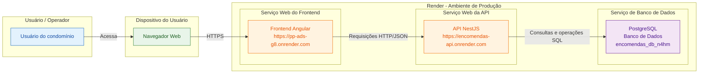
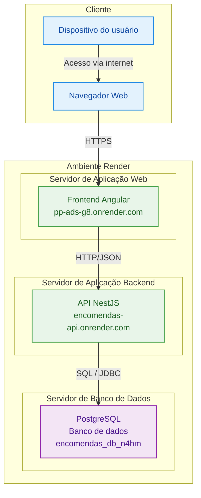

# Diagrama de Implantação - PP ADS G8

A aplicação web do sistema de encomendas é composta por um cliente Angular, uma API NestJS e um banco PostgreSQL. A implantação atual está publicada no Render.

## UML de implantação

## Observações

- O cliente acessa a aplicação por meio do navegador.
- O frontend Angular consome a API REST da aplicação.
- A API NestJS autentica usuários e implementa as regras de negócio.
- O PostgreSQL armazena moradores, encomendas, usuários e dados de controle de retirada.
- Os links de comunicação são realizados via HTTPS entre cliente e frontend e HTTP/JSON entre frontend e backend.
- O banco de dados está em um serviço PostgreSQL do Render, separado do serviço web da API.
- A publicação atual foi realizada no Render com os seguintes endpoints públicos:
    - Frontend: https://pp-ads-g8.onrender.com
    - API: https://encomendas-api.onrender.com
